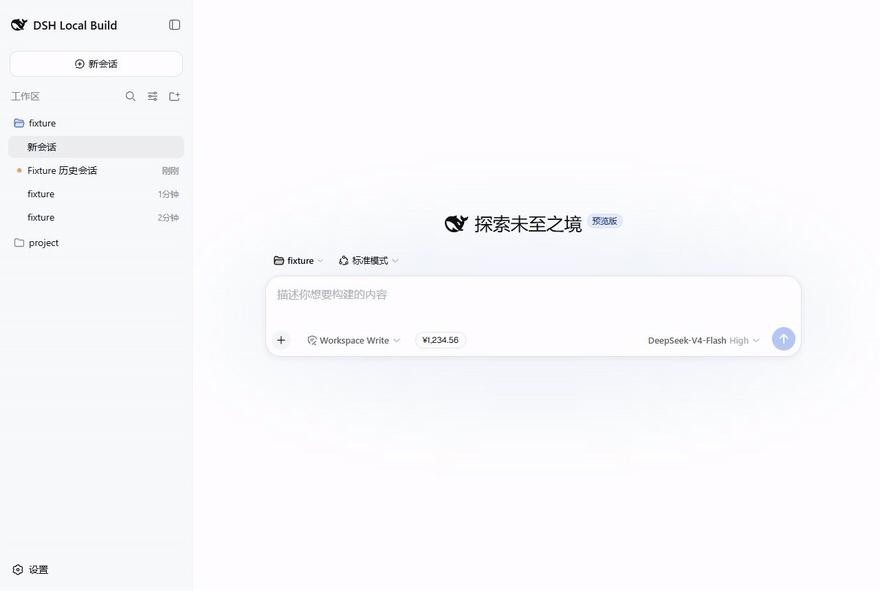
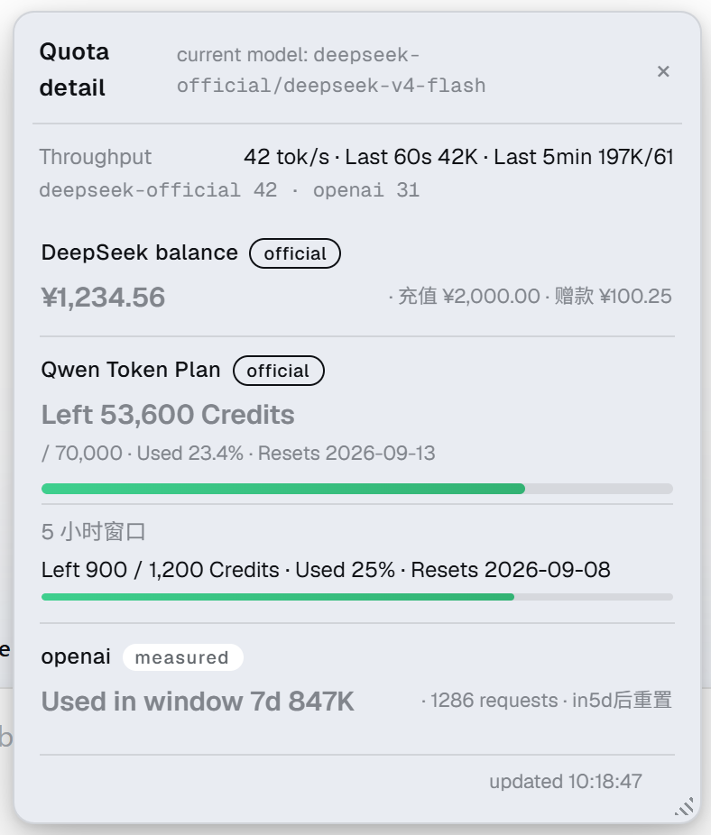
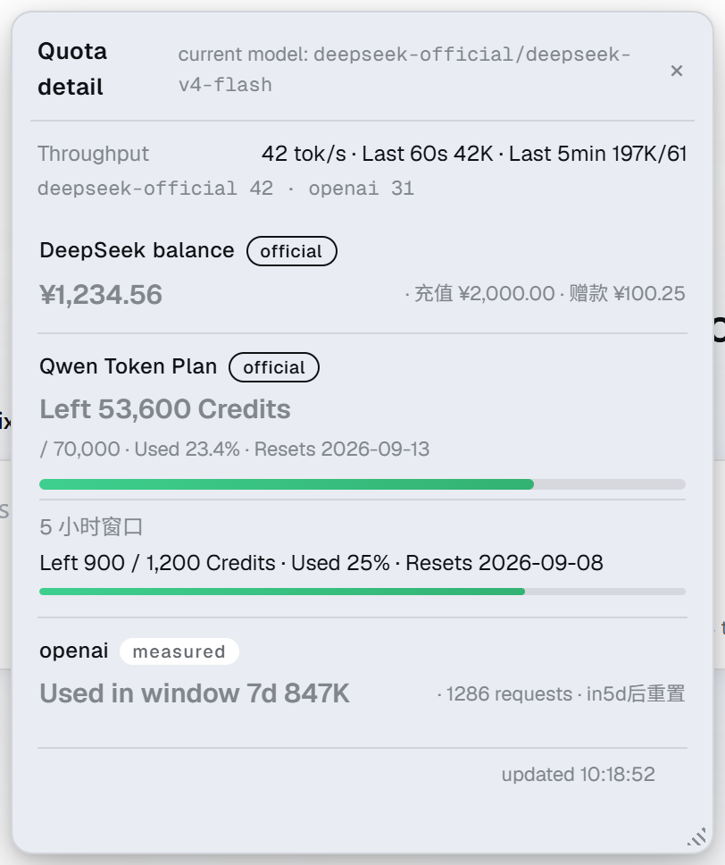
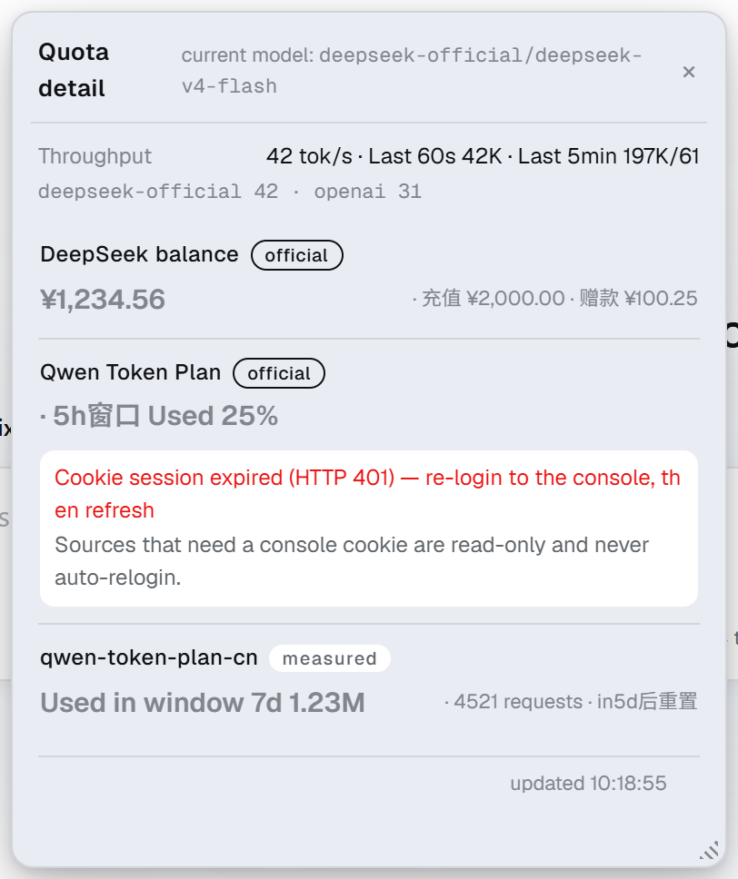
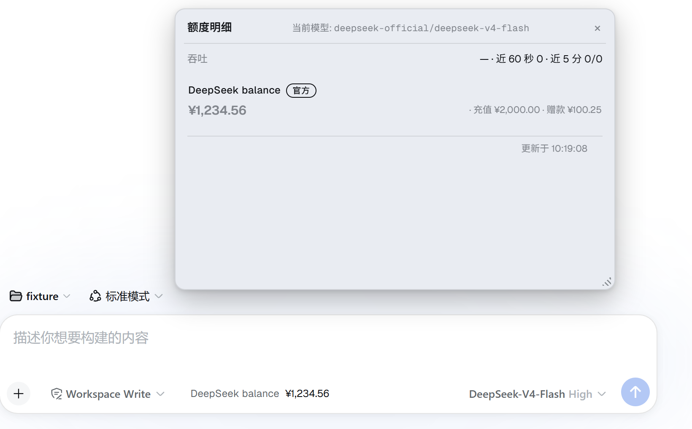
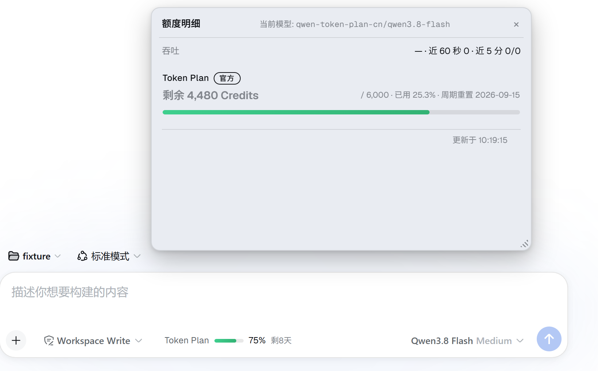

# dsh-token-plan-quota

[中文](README.md) | [English](README.en.md)

A quota chip in the composer toolbar of the [DeepSeek Harness](https://github.com/deepseek-ai/deepseek-harness)
web UI. Official APIs provide the numbers; providers without an official quota endpoint show a clearly-labelled
**measured** view of what this instance actually consumed. **Zero configuration** - which sources to open is
decided from the provider routes you actually have.

```
The chip in the composer tool row follows the active model’s provider:

  Token plan ▓▓░ 79% 5d left         the vendor publishes a denominator → bar + percentage
  minimax-cn 123K tok measured       no official denominator → what was used, never a bar or a percentage
```

**① The chip follows the active model's provider** — one route reports an official true value, and switching to a
route with no official quota API falls back to an explicitly labelled *measured* card:



**② The detail panel**: an official quota card (a bar and a percentage only exist when the vendor publishes a
denominator) plus the multi-window meters of a single card:



**③ The panel detached into a floating window** (drag the title bar, double-click to re-anchor):



**④ The measured card taking over after the console cookie expires**: the official card becomes an error card that
states the reason and carries **no numbers at all**, while the fallback measured card stays on the chip —
no official denominator means no bar and no percentage:



**⑤ Metered-by-balance routes are recognised too**: the DeepSeek balance is an official true value, but there is no
"total" denominator to divide by ⇒ no bar and no percentage, just the amount left, topped up and granted:



**⑥ A provider you have actually used shows its quota**: only when the official API really publishes a denominator
does the card draw a bar and state a percentage and a reset date:



> Every balance, token count and date in those six images is **synthetic sample data**, not any real account
> (this plugin never puts real numbers into the public repo). The English set has one image fewer than the
> Chinese one on purpose: the "this instance has no calls for that provider yet" note is currently only
> emitted in Chinese by the plugin itself, and inventing an English sentence for a screenshot would put words
> in the product's mouth that it never says. Tracked in [ROADMAP.md](ROADMAP.md).
> To reproduce or replace them: [scripts/shots/README.md](scripts/shots/README.md).

## What this plugin does not do

This stance matters more than the feature list:

- **No Credits conversion**, no discount rates, no "remaining balance inferred from history";
- **There is no "I type in my own quota limit" window**: a denominator may only come from an official endpoint,
  so there is no key here that expresses "period + limit". `token-plan-window` is **not** a custom-window
  preset - it is the local measured ledger for Qwen Token Plan (no network, only calls that passed through
  this instance);
- **No denominator, no percentage**: a measured card never draws a progress bar and never shows a percentage -
  it reports only "how many tokens / how many requests were used in this window";
- **Plan configuration is not your quota**: a window exists only when that plan actually reports a reading
  (a `five_hour` cap sitting in `quota-config` does not mean your account has a 5-hour window);
- **Never guess**: detection would rather show one card fewer than pin another vendor's balance to the model
  you are using;
- **No probing that costs money** - read-only endpoints only;
- **No reading other CLIs' local login state** (see [Three credential shapes we will not implement](#three-credential-shapes-we-will-not-implement)).

## Install

```bash
dsh plugin --profile web add dsh-token-plan-quota          # npm package name
dsh plugin --profile web add github:xinghe-1018/dsh-token-plan-quota
dsh plugin --profile web add ./dsh-token-plan-quota        # local directory
```

`dsh plugin` passes through to pnpm inside the profile directory. This plugin has **zero third-party
dependencies and no build step**, so it never trips pnpm ≥10's build-script allowlist.
**Restart `dsh web` once** after installing (bundles and client entries are assembled at startup).

The only external resource at runtime is three CDN font links; if they fail, the UI falls back to system fonts.

## Supported vendors

| Vendor | Quota source | What the chip shows | Verification status |
|---|---|---|---|
| DeepSeek | ✅ official `/user/balance` (Bearer) | balance + topped-up + granted (truth) | verified with a real key |
| Qwen Token Plan | ⚠️ console data gateway (**cookie session**, not a published API) | used % + progress bar (same source as the subscription page); falls back to the measured card when the cookie is missing/expired | verified with a real account |
| Moonshot / Kimi open platform | ✅ official `/v1/users/me/balance` (Bearer; `.cn` CNY / `.ai` USD) | balance + cash + voucher (truth) | endpoint existence probed; **field names not yet checked against a real key** |
| OpenRouter | ✅ official `/api/v1/credits` (Bearer) | balance (USD) = total credits − total usage | endpoint existence probed; **field names not yet checked against a real key** |
| Aliyun BSS | ✅ BssOpenApi (AK/SK signature) | account balance / resource packs (truth) | every field checked against official OpenAPI metadata |
| MiniMax, OpenAI/Gemini with a plain API key, … | ❌ no key-authenticated quota endpoint | **measured** card (tokens / requests only) | common paths probed; no endpoint exists |

Per-vendor endpoints, envelope fields, unit traps and percentage direction are documented in
[`docs/upstream-contracts.md`](docs/upstream-contracts.md).

**API hosts only, never console domains**: web console domains such as `platform.kimi.com`,
`platform.moonshot.cn` and `bailian.console.aliyun.com` take no part in detection - the plugin queries balance
APIs, which live on the API host the route's `baseURL` points at (`api.moonshot.cn` / `api.moonshot.ai`).
A Kimi open-platform key belongs to the same account and balance as a Moonshot one, so point the route at
`api.moonshot.*`; if your `baseURL` says something else, detection will not recognise it and you get the
measured card instead. To force the official card, do not just name the source - **bind it to your real route
id**, or under the default `panelScope: "current"` it is queried but never displayed (the preset carries generic
names like `moonshot`, which do not include your route):

```json
{ "sources": [{ "id": "moonshot-balance", "providers": ["kimi-open-cn"] }] }
```

Mind the last column of the table above: this vendor's field names are not yet checked against a real key, so if
the forced card looks wrong, compare field names with `probe`. When a `providers` list binds to nothing at all,
the host logs a warning - you are not left guessing in front of an empty panel.

### How this differs from neighbouring plugins

The ecosystem already has related plugins (`dsh-cost-meter` covers nine coding plans plus cost estimates;
`dsh-token-monitor` does per-request cost accounting). The difference is the accounting stance: this plugin
reports **only official truth or explicitly-labelled measurement, never conversions or estimates**, the chip
**follows the current model's provider**, and it ships the Qwen Token Plan console-quota contract that the
others do not. If you want a cost dashboard, pick that one; if you want "how much is left on the provider I
am using right now", pick this one.

## Zero-configuration detection

The provider routes live in your harness are the **single source of truth** for which sources to open, so you
never write `sources` and never hand-fill `providers` - historically those two lists drifting apart is exactly
what produced "the card is queried but never displayed". Matching runs in confidence order, first hit wins:

| Signal | Notes |
|---|---|
| `baseURL` host | Most trustworthy - where the route actually points. `api.moonshot.cn` → Moonshot mainland region, `openrouter.ai` → OpenRouter, the Token Plan gateway → Qwen |
| route id / display name | Used **only when no host is available** (the shipped `deepseek-official` route relies on this) |
| key prefix | Last resort (`sk-or-` → OpenRouter) |
| nothing matched | Attach a `window:<provider>` measured source **per unmatched route** (three unrecognised routes, three cards): the chip stays visible, reporting local tokens/requests only |

**In this document `provider`, "route id" and the strings inside `providers` are the same thing**: the `id`
returned by the host's `llm.listProviders()` (compared case-insensitively, with `.` `_` `/` all treated as `-`).
So the `window:minimax-cn` card only appears for the model on route `minimax-cn`, and the fallback detection
attaches is called exactly the same (`window:minimax-cn`) - one card, two spellings.

Two invariants:

- **Your configuration always wins - as a layer, not as a replacement.** With `autoDetect: true` (the default)
  what you write lands first and detection then fills in **the parts you said nothing about**; adding one entry
  never wipes the cards it did not mention. "Already covered" has exactly three meanings:
  (1) one of your sources lists this route id in `providers` → detection adds nothing to that route;
  (2) you have a source with the same `id` → detection will not open a second one (`skipped` records
  `id-taken-by-configured`); (3) you wrote `{"id":"<source>","enabled":false}` → that name is never opened
  automatically again (`skipped` records `disabled-by-config`). A fourth case is not a coverage rule at all: a
  source whose credential cannot be resolved is simply not opened (`skipped` records `no-credential` and lists the
  reference names it tried; no error card taking up space). Only `autoDetect: false` makes your list the
  single source of truth.
- **Explainable.** Every auto-opened card carries `detected: {by, rule, host, fallback}`; its tooltip says
  "identified from api.moonshot.ai · region international", and the snapshot's `detection` block lists live
  routes, what was opened, what was skipped and why, and which routes were not recognised - one place to
  answer "why is this provider missing" (**it is only in the `GET /token-plan-quota/summary` payload; the panel
  does not render it**). On an older host without an `llm` service, detection degrades
  silently to the configured sources.

## Interface

- **The chip follows the model**: it subscribes to the host's existing `sessions.list` → `modelDirectories`
  runtime stores, so switching models updates the card immediately - no polling, no extra network.
  Priority: an official card with numbers > a measured card with numbers > an errored official card
  (which tells you to configure the cookie).
- **One quota card per provider**: when the official card has numbers, the auto-attached measured fallback card
  is hidden; when the official card turns into an error card, the fallback must come back. This decision lives
  in the display layer where the data is visible - deciding it at planning time left a blank badge the moment
  a cookie expired.
- **A card can carry several windows**: the host orders them into `card.meters` (**this is the card shape in the
  snapshot, not a key you can write in a source entry**); `meters[0]` is the same source
  as the top-level value (shown by the headline and the main bar), and each further window gets its own row -
  "label · remaining/total · used% · resets" - with its own thin gradient bar.
- **The detail panel is a persistent window**: drag it by the title bar, resize with the bottom-right handle,
  position and size persist in `localStorage`, double-click the title to re-anchor.
  **Clicking anywhere else never closes it** - only clicking the chip again or pressing `Esc` does.
  Dismiss-on-outside-click is dropdown semantics that conflicts with this, and identifying the host's input
  area via selectors is guaranteed to leak (the shipped web bundle does not even contain
  `data-composer-card`).
- Visuals: a ghost control with no border, no status dot and no emoji - **the gradient balance bar is the
  status** (≥70% green, 40-70% blue, <40% orange→red); "official / measured" pills mark the tier; its own font
  stack (Geist Variable + Noto Sans SC, system fallback offline) with monospace reserved for identifiers;
  every animation respects `prefers-reduced-motion`.
- `panelScope: current` (default) lists only the current provider's cards; set `"all"` to see every source.
- **"Measured" has exactly one meaning in this document**: a number computed from the local ledger, never an
  official balance. It appears in three places - the "this instance, measured" block in the panel (that is what
  `showInstanceWindow` toggles), the `window:<provider>` card for any vendor, and the built-in
  `token-plan-window` (which simply *is* the Qwen ledger). All three default to a 7-day window, changeable with
  `windowDays`; the window is anchored at this instance's first call, and "reset this cycle" re-anchors it.

## Configuration

Main config lives in `~/.dsh/token-plan-quota.json` - the host re-reads it before every query, so **changes
apply without a restart** (it can also go in the bundle row's `config`; the JSON wins):

```json
{
  "autoDetect": true,
  "refreshMinutes": 10,
  "pollSeconds": 10,
  "panelScope": "current",
  "debug": false
}
```

The table below has 18 rows: 17 are keys of `DEFAULTS` in the code, and `moonshotRegion` is the exception - it is
not in `DEFAULTS` but is read by the Moonshot source through `regionConfigKey`. **One key per row, and the unit is
part of every name** (`Minutes` / `Seconds` / `Ms`).

| Key | Default | Meaning |
|---|---|---|
| `autoDetect` | `true` | Fill in sources from the host's live provider routes. **Writing `sources` does not switch it off**: your entries are one extra layer and detection still covers the routes you said nothing about, so `"sources": []` merely means "I have no additional request" (identical to omitting it). Set `false` to make your list the single source of truth: with nothing written you get the two built-ins `deepseek-balance` + `token-plan-window`, and with `"sources": []` you get **no cards at all** |
| `sources` | none (detection decides) | Ordered source list. Built-in names (8): `deepseek-balance` (DeepSeek balance), `token-plan-console` (Qwen console quota, cookie), `token-plan-window` (**Qwen local ledger** - not a custom window), `moonshot-balance` (Moonshot/Kimi balance), `openrouter-credits` (OpenRouter balance), `account-balance` (Aliyun account balance), `fr-instances` (Aliyun resource-pack instances), `resource-package` (Aliyun resource-package allowances); or the `window:<provider>` shorthand (a measured window for any vendor); or a custom object (see [Custom sources](#custom-sources)) |
| `moonshotRegion` | `china-mainland` | `china-mainland` (`api.moonshot.cn`, CNY) or `international` (`api.moonshot.ai`, USD). **Keys do not work across regions**; a wrong region returns 401 and the card tells you to switch. Host and currency switch as a pair - there is no auto-probing |
| `refreshMinutes` | `10` | Cache TTL for official sources in minutes: TTL = minutes × 60 s, **floor 15 s**, so `"refreshMinutes": 3` means one upstream call per 3 minutes (sub-minute polling is not what this key is for - see `pollSeconds`). The panel's "updated" line or `?fresh=1` forces a refetch |
| `pollSeconds` | `10` | Front-end poll interval - how often the UI re-reads the snapshot. Measured values and throughput are recomputed live anyway; lowering this never adds upstream calls |
| `panelScope` | `current` | `current` lists **only cards whose `providers` include the active route id**, plus this instance's usage; `all` lists every source. That means the three Aliyun sources are **invisible under `current`** - an account balance and its resource packs have no provider binding, so they never enter a route-filtered view; set `"all"` to see them |
| `showInstanceWindow` | `true` | Include the "this instance, measured + retry observations" block in the panel. It is **not** a data-source switch and does not affect `window:<provider>` cards |
| `exposeTool` | `true` | Register the `token_plan_quota` model tool |
| `debug` | `false` | Permanently echo the upstream response's **field skeleton** (values masked, credential-like keys skipped) in the panel. Same output as `GET /token-plan-quota/probe?source=<id>`; the difference is that debug is always on while probe is one-off and needs no config change |
| `endpoint` | `business.aliyuncs.com` | Aliyun BSS sources only: OpenAPI endpoint (change it for the international site). A leading `https://` and trailing slashes are stripped |
| `regionId` | none | Aliyun only: the OpenAPI `RegionId` |
| `accessKeyIdRef` | `ALIBABA_CLOUD_ACCESS_KEY_ID` | Aliyun only: credential reference name for the AccessKeyId |
| `accessKeySecretRef` | `ALIBABA_CLOUD_ACCESS_KEY_SECRET` | Aliyun only: credential reference name for the AccessKeySecret |
| `securityTokenRef` | none | Aliyun only: credential reference name for an STS token (leave empty with long-lived AK/SK) |
| `configPath` | `$DSH_HOME/token-plan-quota.json` | Where the external JSON config lives (`~/` = OS home, `$DSH_HOME/` = harness home) |
| `usagePath` | `$DSH_HOME/token-plan-quota.usage.json` | Where the local ledger is persisted |
| `minIntervalMs` | `1200` | Minimum interval between outbound calls (ms), throttling globally |
| `timeoutMs` | `15000` | Per-request upstream timeout (ms, floor 1000) |

### Turning one single card off

An item of `sources` may be a built-in name (a string) or an object - **options only attach to the object form**,
so to switch one card off, turn that item into an object. **This is an exclusion, not a replacement of the whole
list**: leave `autoDetect` at `true` and every other card is still filled in.

```json
{
  "autoDetect": true,
  "sources": [
    { "id": "deepseek-balance", "enabled": false },
    { "id": "fr-instances", "enabled": false }
  ]
}
```

- **It works on sources that detection opened too**: with `{"id":"moonshot-balance","enabled":false}` written,
  detection will not add that card back, and the `skipped` list keeps a `disabled-by-config` entry - so
  "not recognised" and "you switched it off" stay distinguishable.
- **It switches off this source, not this vendor** - but what is left for that vendor depends on whether it is in
  the rule table, and that has to be spelled out:
  - **Recognised vendors** (DeepSeek / Moonshot / OpenRouter) have exactly one official source each, so switching
    it off leaves **no card**: the measured fallback is only attached to routes detection could *not* recognise.
  - **Qwen is the exception**: it carries both `token-plan-console` (official) and `token-plan-window`
    (measured), so switching the first off leaves the second in place.
  - **Unrecognised vendors** (MiniMax and friends) already have only a `window:<provider>` card; to drop that,
    name it: `{"id":"window:minimax-cn","enabled":false}` (`<provider>` is the route id - see the section above).
- Prefer a clean sweep? Set `autoDetect: false` and write the whole list yourself. Either way,
  **what you wrote always wins**.

### Credentials

Resolved in order: **DSH credentials service → environment → `~/.dsh/.credentials.yaml` → `~/.dsh/.env`**,
re-resolved on every query, so swapping a key needs no restart.

| Source | Reference name |
|---|---|
| DeepSeek | `DEEPSEEK_API_KEY` |
| Moonshot | `MOONSHOT_API_KEY` (must match the region; detection prefers the name the route's own profile declares, e.g. `MOONSHOT_CN_API_KEY`) |
| OpenRouter | `OPENROUTER_API_KEY` (`sk-or-v1-…`) |
| Qwen Token Plan quota | `BAILIAN_CONSOLE_COOKIE` (+ optional `BAILIAN_CONSOLE_SECTOKEN` as an override) |
| Aliyun | `ALIBABA_CLOUD_ACCESS_KEY_ID` / `ALIBABA_CLOUD_ACCESS_KEY_SECRET` |

Reference names can be overridden per source with `bearerRef` / `cookieRef`.

To see the **real** Qwen Token Plan quota (the "65.1% left / 10,000 total" from the subscription page):
sign in and open the [subscription page](https://platform-home.qianwenai.com/analytics/token-plan/individual) →
F12 → Network → copy the **entire `Cookie:` request header line** → store it as one line
`BAILIAN_CONSOLE_COOKIE: <content>` → click "updated" in the panel to refresh. Cookies usually last a few weeks;
when one expires the source reports an error and the measured card takes over until you re-paste.

### Custom sources

When a vendor publishes a new endpoint, or you want to wire in a console API yourself, you do not need to wait
for this plugin. `kind: "single"` with `fields`/`derive` covers the "balance is a difference" shape:

```json
{
  "sources": [{
    "id": "my-balance", "label": "My balance", "kind": "single", "metric": "money",
    "url": "https://example.com/api/account", "method": "GET", "bearerRef": "MY_API_KEY",
    "unit": "USD",
    "fields": { "credits": ["data.total_credits", "total_credits"], "usage": ["data.total_usage", "total_usage"] },
    "derive": { "total": "credits", "used": "usage", "remaining": "credits - usage" },
    "providers": ["my-provider"]
  }]
}
```

`derive` accepts exactly one `+`/`-` with a field reference or a number on each side, and **returns nothing if
either side is missing** - it never invents a number. Multiply, divide or parenthesised expressions mean you
should write a dedicated builder instead. The slot names in `fields` are yours to choose (`credits`/`usage` above
are just names - they are also the variables `derive` can reference), and giving each slot several candidate paths
is deliberate: the same API has shipped with and without a `data` envelope.

#### Every key a hand-written entry accepts

**An unrecognised key raises no error and does nothing** (entries are merged verbatim), so a typo in a key name
shows up as "the card stays empty", not as a failed start. This table is the authoritative list:

| Key | Applies to | Meaning |
|---|---|---|
| `id` | required | Source identifier, also the cache key and the `probe?source=` argument. Two entries sharing an `id` share a cache and stack into two cards (the log warns); rename the second one |
| `kind` | recommended | `single` (one reading - the default when omitted) / `list` (a list of resources) / `window` (measured window for this instance, no network) |
| `label` / `labelEn` | title | `label` is the card title and falls back to the entry's `id` when omitted. `labelEn` ships in the snapshot but **the UI does not consume it today** (the panel title reads `label` only); it is reserved for host localisation |
| `url` | `single` / `list` | Endpoint. With `url` present the source is HTTP; without `url` and not a built-in name, it is treated as an Aliyun OpenAPI **RPC** call (needs `action` + `version`) |
| `method` | HTTP | Defaults to `GET` |
| `headers` | HTTP | Extra request headers, merged over `accept: application/json` |
| `jsonBody` / `formBody` | HTTP (POST) | JSON body / `application/x-www-form-urlencoded` body |
| `bearerRef` / `cookieRef` | HTTP | Credential reference names. A Bearer source honours only `bearerRef`, a cookie-session source only `cookieRef` - **a plan key is never used in place of a cookie** (nor the reverse), because that only produces a misleading error card |
| `action` / `version` / `params` | RPC | OpenAPI action, version and query parameters (`params` are flattened). An RPC source missing `action` or `version` yields an error card |
| `paginate` | RPC | `{ "mode": "page", "request": "PageNum", "pageSize": "PageSize", "total": ["TotalCount"] }`, or `{ "mode": "token", "request": "NextToken", "response": ["NextToken"] }`; page mode stops after 10 pages |
| `fields` | `single` | variable name → array of candidate paths; only the ones that resolve enter the `derive` scope |
| `extract` | `single` | Paths for values the upstream hands over directly: `remaining`, `total`, `unit`. These are also referenceable by `derive` |
| `derive` | `single` | Only `remaining` / `total` / `used` are consumed; if you omit `used` and both `remaining` and `total` resolve, the difference is computed |
| `extra` | `single` | Secondary figures, names are yours; `toppedUp`/`granted`/`cash`/`credit`/`quotaLimit` have established wording |
| `list` / `item` | `list` | `list` is the array of candidate paths; `item` may name `name`/`id`/`remaining`/`total`/`used`/`unit`/`status`/`expiresAt`/`startsAt`/`cycleType`/`capacityType`/`haystack` |
| `metric` | display | `money` / `credits` / `count`. The default depends on the builder: a hand-written `single` source defaults to `money`, `list` to `credits`, `window` to `count` - **set it explicitly when you want tokens** |
| `unit` | display | Fallback unit when upstream gives none (e.g. `USD`); with `metric:"money"` and no upstream currency it falls back to `CNY` |
| `providers` | panel grouping | The **route ids** this source belongs to (see "provider = route id" above); under `panelScope: "current"` a card is displayed only if this list contains the active route, and if you write names that match no live route the host logs a warning. The `window:<provider>` shorthand fills it in |
| `windowDays` | `window` | Measured window length in days; default 7, minimum 1 |
| `regions` / `region` | multi-region vendors | `regions` maps a region name to its field overrides (host and currency switch together); `region` picks one. An unknown region warns and falls back to the first |
| `enabled` | any | `false` disables the entry (handy for switching one source off without deleting a block) |

**Keys outside this table are reserved for built-in presets - do not copy them into a hand-written entry**:
`builder`, `apiPrefix`, `consoleSite`, `gatewayAction`, `gatewayProduct`, `infoUrl`, `secTokenRef`,
`dashboardURL`, `regionConfigKey`, `errorHints`, `keywords` all drive vendor-specific signing / CSRF / envelope
flows that only hold for the matching preset. In particular, **multi-row window cards** (the "5 hour" + "weekly"
pair in the panel) are produced **only by `token-plan-console`**; one hand-written entry yields one reading, so
write two sources to show two windows. For a measured window use
`{"kind":"window","providers":["my-provider"],"label":"My window","windowDays":30}` or the
`window:<provider>` shorthand. The full onboarding checklist is in
[`docs/adding-a-provider.md`](docs/adding-a-provider.md).

#### The card is empty and nothing errored - triage in this order

1. `GET /token-plan-quota/probe?source=<id>` (or temporarily set `"debug": true`) - look at which field names the
   upstream **actually** returned;
2. Check every key against the authoritative table above: **an unrecognised key does not fail, it just does
   nothing**, which is exactly why the symptom is an empty card rather than a failed start;
3. Confirm the `fields` paths really hit this response (the same API has shipped with and without a `data`
   envelope) and that every name `derive` references resolved - one missing operand empties the whole line;
4. If the card is **missing entirely**, that is usually a different problem: a source whose credential cannot be
   resolved is not opened at all (no error card taking up space), or it is outside `panelScope: current`'s view.
   The snapshot's `detection` block names who was skipped and why.

## Throughput (measured, not estimated)

The host wraps `llm/stream` and records the active time from the first chunk to the usage chunk. Two metrics
are kept strictly apart:

- **Speed (generation/decode)**: `lastTps` = output tokens ÷ active seconds; `genTps` = output ÷ active seconds
  over the last 5 minutes (no number at all below 1 second of active time, to stop very short streams being
  extrapolated). **Cache reads are excluded from the numerator** - otherwise a single call with 360K cached
  tokens would inflate the reading to tens of thousands of tok/s;
- **Throughput (volume)**: `tpm60` / `tokens300` count all tokens including cache reads - the billing and
  transport view; `outTps60` is the average output speed over the last 60 seconds.

The sliding window is persisted with the ledger, so the last five minutes survive a host restart. The chip's
speed label uses only the row for the current model's provider, preferring the most recent single stream
(within 90 seconds), then the 60-second output average, then the 5-minute generation speed; nothing is shown
without recent activity.

## Read-only routes and the model tool

| Endpoint | Purpose |
|---|---|
| `GET /token-plan-quota/summary` | Snapshot (official sources honour the TTL; `?fresh=1` forces a refetch); includes the `detection` diagnostics block |
| `POST /token-plan-quota/refresh` | Refetch official sources |
| `POST /token-plan-quota/reset` | Clear this instance's measured totals (including window anchors) |
| `GET /token-plan-quota/probe?source=<id>` | Upstream field skeleton (for troubleshooting) |

Same-origin requests only, and **keys are never returned**. On the model side there is the `token_plan_quota`
tool (`status` / `refresh` / `reset`).

Working with 429s: configure `retryPolicy` for that provider in `settings.yaml` (add `QUOTA` to
`retryableCodes`, and set `initialDelayMs == maxDelayMs` with `jitterRatio: 0` to flatten the backoff into a
fixed interval). The panel's "automatic retry observations" shows the retries that actually happened, the
seconds waited and the effective policy - read from the persisted `llm/retry` event's `policyKey`, not estimated.

## Known limits

- Measured windows count only calls that went **through this DSH instance**: consumption from other devices or
  tools is not included, and the official Credits conversion rate is not published - which is why these cards
  report tokens and requests, never "remaining quota".
- If someone resets the quota in the vendor's console, this instance's window cannot notice it; use
  `token_plan_quota` (`reset`) to restart the count.
- Observation counters cover the current process lifetime; the durable record stays in the session logs.
- Seat fallback: if the shell does not declare `conversation.input.left`, the chip docks to
  `conversation.input.dock`; on shells that expose no react-dom seed the panel falls back to inline CSS
  anchoring and dragging is disabled.
- Moonshot and OpenRouter field names are **not yet verified against a real key** (official docs plus endpoint
  existence only).

## Three credential shapes we will not implement

These require reading another CLI's local login state or extra high-privilege credentials, and are out of scope
for permission and account-risk reasons. Related PRs are not accepted either - if you need them, wire the
endpoint up yourself via [custom sources](#custom-sources):

- Zhipu GLM team mode (`Bigmodel-Organization` / `Bigmodel-Project`)
- Kimi Code browser cookies / `~/.kimi-code/credentials/*`
- Codex·ChatGPT and Gemini CLI OAuth tokens (`~/.codex/auth.json`, `~/.gemini/oauth_creds.json`)

## Disclaimer

The Qwen Token Plan quota card uses a **console data gateway authenticated by login cookie - not a published
official API**. Upstream may change or refuse it at any time. If its terms of service prohibit this kind of
access, **do not enable that source** (drop `token-plan-console` from `sources`, or set `autoDetect: false` and
omit it). The cookie is parsed locally, used in-process only, and **never appears in any route response** -
see [`SECURITY.md`](SECURITY.md) for details.

## Development

```bash
npm run check                       # all four steps below
node test/host.mjs                  # 351 assertions, offline
node test/client.mjs                # 116 assertions, fake React/DOM/fetch
node scripts/check-manifest.mjs     # manifest self-check (installability, outbound hosts, license, zero deps)
node scripts/check-docs.mjs         # every verifiable claim in the READMEs must match the code
```

`check-docs` is not decoration: it takes the numbers written in these READMEs - "17 DEFAULTS keys, an 18-row
config table, 8 sources, 8 declared outbound hosts, 351/116 tests" - and checks them against the code and a real
test run, so a drifting
number turns CI red (verified with a deliberately broken copy that it does fail).

Tests are cross-platform (temp directories come from `os.tmpdir()` and never touch a real `~/.dsh`); CI runs
node 20/22 across ubuntu/windows/macos plus a "the published tarball loads" smoke test
(`npm pack` → untar → `import lib/index.js`). Contribution workflow and product invariants are in
[`CONTRIBUTING.md`](CONTRIBUTING.md); the three release channels (GitHub topic / npm / plugin directory) are in
[`RELEASE.md`](RELEASE.md).

## License

[MIT](LICENSE)
